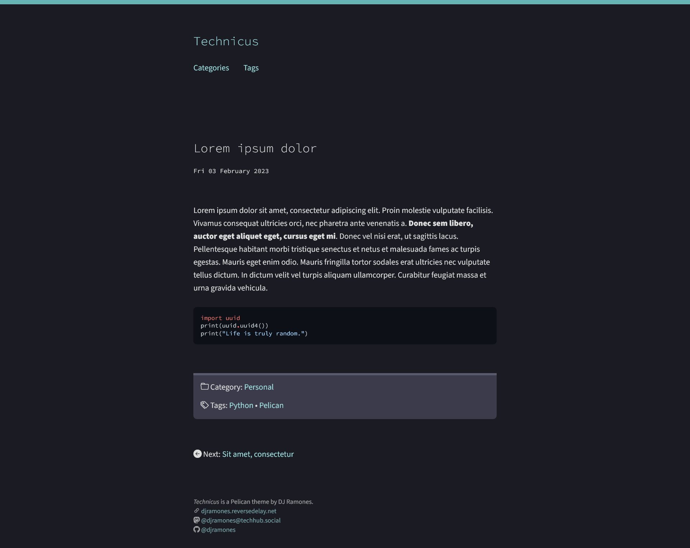

# **Technicus**, a Pelican theme

Technicus is a minimalist, light-on-dark, mobile-friendly [Pelican](https://getpelican.com/) theme intended for single-author blogs.

## Demo

See this theme in action on the blog [tech.reversedelay.net](https://tech.reversedelay.net).

## Limitations

As this theme’s development has been driven only by the needs of a particular single-author blog, there are several limitations, including:

- Many HTML elements in the “kitchen sink” set have not yet been specifically supported or tested.
    - Default browser styles are not reset, however, so most elements will still look fine.
- This theme might conflict with SEO plugins as it already includes a basic implementation of Open Graph and `<meta name="description">` tags.
- The author-related and general-archives templates are not implemented (`author.html`, `authors.html`, and `archives.html`). This means `'authors', 'archives'` have to be removed from the `DIRECT_TEMPLATES` setting, and `AUTHOR_SAVE_AS` set to `''`.
    - Period archives (year/month/day), however, are implemented.
- The menu is entirely configured through a custom setting (pages and categories are not automatically listed, ignoring the `DISPLAY_PAGES_ON_MENU` and `DISPLAY_CATEGORIES_ON_MENU` settings).
- Feeds (Atom/RSS) are not implemented.
- This theme has been tested only on the latest versions of Firefox and Chromium-based browsers on a small number of devices.

Feel free to fork this repository and make modifications according to specific project needs, and perhaps to even share back improvements through pull requests.

## Usage

### Prerequisites

This theme assumes that the [`pelican-neighbors`](https://github.com/pelican-plugins/neighbors) plugin is installed, for easy navigation between chronologically-adjacent articles.

### Settings

- **`TECHNICUS_FAVICON`** (*optional*): the path to the site favicon relative to `SITEURL`, including the starting slash. For example, `TECHNICUS_FAVICON = '/images/favicon.png'`.
- **`TECHNICUS_SITE_META_DESC`** (*optional*): the description string to be set in the Open Graph and `<meta name="description">` tags for the home (index) page.
- **`TECHNICUS_DEFAULT_OG_IMAGE`**: the image to be used for Open Graph (i.e., social sharing previews). This must be set to the path of an image file relative to `SITEURL`, including the starting slash. (Note: despite the setting name, Technicus currently does not support specifying page-specific Open Graph images; i.e., this same image will show up in the social previews for any page in the site.)
- **`TECHNICUS_NAV`**: a list of two-item `(<title>, <url>)` tuples representing the main menu items. For example,

        TECHNICUS_NAV = [
            ('About', '/about/'),
            ('Categories', '/categories/'),
            ('Tags', '/tags/'),
        ]

- **`TECHNICUS_FOOTER_HTML`**: the contents of this will show up in the footer wrapped in `<small>` tags. For example, here is a footer that takes advantage of the [Bootstrap Icons](https://icons.getbootstrap.com/) included in this theme:

        TECHNICUS_FOOTER_HTML = """
        <cite>Technicus</cite> is a Pelican theme written by <a href="https://djramones.reversedelay.net/">DJ Ramones</a>. 
        <i class="bi-link-45deg"></i> <a href="https://github.com/djramones/technicus">github.com/djramones/technicus</a> 
        <i class="bi-github"></i> <a href="https://github.com/djramones/technicus">@djramones/technicus</a>
        """

#### Custom 404 page

This theme includes a simple 404 page template. If `'404'` is included in the `DIRECT_TEMPLATES` setting, a `404.html` file will be generated in the output root, making it ready for use by hosting services like [GitHub Pages](https://docs.github.com/en/pages/getting-started-with-github-pages/creating-a-custom-404-page-for-your-github-pages-site) and [Cloudflare Pages](https://developers.cloudflare.com/pages/platform/serving-pages/#not-found-behavior).

### Content metadata

Aside from the usual content metadata (`Title`, `Date`, `Slug`, `Category`, `Tags`), this theme makes use of:

- `Modified`: the last-modified date of the content; displayed on both articles and pages
- `Description`: text that goes into the Open Graph and `<meta name="description">` tags; it is recommended to keep this short
- `Summary`: used on the index pages; can be set to blank (e.g., in Markdown content, a `Summary: ` line) to disable summaries on the index pages (so that only the title shows up)

## Acknowledgements

This theme uses and includes the following:

- Source Sans Pro and [Source Code Pro](https://github.com/adobe-fonts/source-code-pro) typefaces (SIL Open Font License Version 1.1)
- [Bootstrap Icons](https://icons.getbootstrap.com/) (MIT License)
- [Normalize.css](https://necolas.github.io/normalize.css/) (MIT License)
